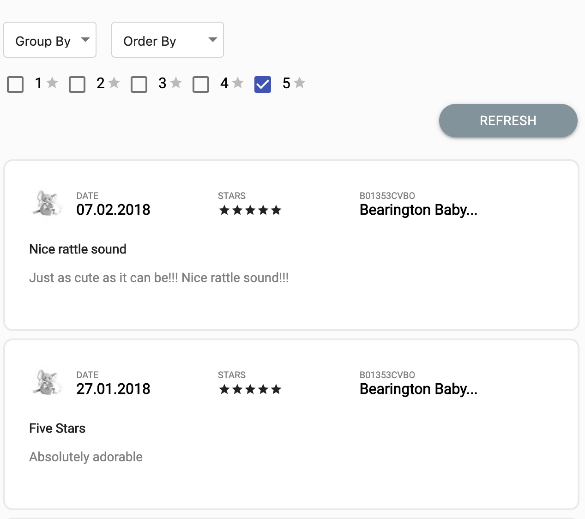

# User Reviews App(React, Redux)

### Setup
Below are the steps to get it running.

1. `yarn`  Installs all the dependencies.
2. `yarn start`  Starts the application.
3. `yarn test`  Run all the tests using the test command (optional step)

Once the server is up the site will be available at `http://localhost:3000/`

# Description

Design and implement a React + Redux application that resembles the Reviews section of an Amazon
Products page.

## Requirements
- [x] Reviews can be grouped by day, week, or month. Make sure you show the time interval for
which reviews are shown (i.e. “05.02”, “05.02 - 11.02” or “January”)
- [x] Reviews can be filtered by number of stars. The default state should show 5 star reviews only.
- [x] Reviews should be sortable by time. Users should be able to toggle between showing most
recent reviews first, or last.
- [x] Infinite scrolling. As you scroll, more reviews will be loaded.

#### Approach
I have created the application with create react app, and below is the pattern followed in the implementation

##### Components 
- The complete app is divided in to multiple reusable components/views to maintain the code's reusability, 
each component is independent of each other and can be reused wherever it's require with custom data.
- I have used material UI as a base and created wrappers around the components for customisation based on the mock up.

##### Containers
- Components are wrapped with containers to get the Redux state and actions as props.
- Followed the styled components pattern.

##### Actions
- Actions are plain javascript objects with TYPE property in it, actions will be dispatched based on user interactions with the application.

##### Reducers 
- Reducers are pure functions which will take action object as input parameters and will update the Redux state accordingly.
- I created the individual reducers for each action to follow a TDD approach and to make it more maintainable and readable.

##### Selectors
- Selectors are used to compute derived data, allowing the application to avoid unnecessary computation or re-rendering.
- Selectors are efficient. A selector is not recomputed unless one of its input arguments changes.
- Selectors can be composed and they can be used in other selectors to provide params which helps increase the maintainability.

##### Helpers 
- Helpers are pure functions, which will calculate the new value and returns it based on input parameters.

##### Constants 
- Constants are used to define the STATIC DATA in the application.

##### Custom Middleware
I created some custom middleware to handle the all API requests in the application with common action, instead of creating different API calls in action creators.
 
- This will allow us to handle a loading spinner/loader globally across the application when handling with different API calls.
- Action creators can be easily tested as all async calls will be handled in custom middleware.
- Code in the action creator is clean and uniform.
- When application is becoming bigger, we can handle all API calls across the application easily with clean code.

### Sample screens

